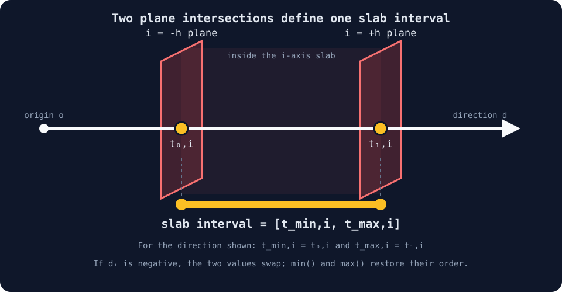
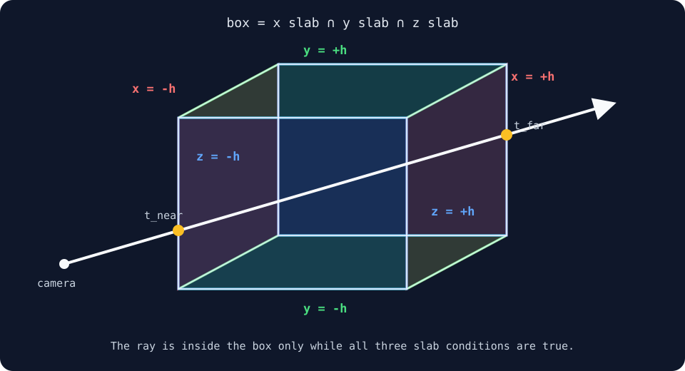
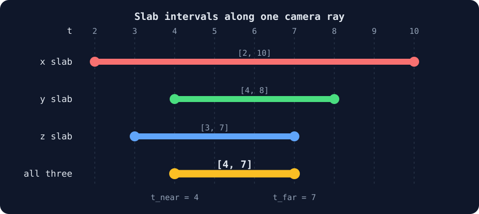

# 02 — Ray Box Intersection

## 목표

volume은 유한한 영역을 차지합니다. 이 단계는 camera ray가 축 정렬
상자(axis-aligned box) 내부에 있는 구간을 구합니다.

$$
t\in[t_{\mathrm{near}},t_{\mathrm{far}}].
$$

box를 통과하지 않는 pixel은 어둡게 남고, 교차한 pixel은 box 내부 segment
길이를 color로 보여줍니다.

## Parameter

`Volume size`는 box의 half-extent $h$를 조절합니다. 기본값 $h=2$이면
각 축의 범위는 $[-2,2]$이고, box의 전체 width, height, depth는
$2h=4$입니다. 이후 모든 volume rendering 단계도 같은 기본값과 조절
범위를 유지합니다.

## 1. Ray 방정식에서 시작하기

camera ray는 다음과 같이 매개변수화(parameterization)됩니다.

$$
\mathbf{r}(t)=\mathbf{o}+t\mathbf{d}.
$$

- $\mathbf{r}(t)$: ray를 따라 도달한 world-space position
- $\mathbf{o}$: camera position인 ray origin
- $\mathbf{d}$: 현재 pixel의 정규화된 ray direction(normalized ray direction)
- $t$: camera에서 이동한 world-space distance

아래첨자 $i$는 $x,y,z$ 중 하나의 coordinate axis를 선택합니다.

$$
r_i(t)=o_i+t d_i.
$$

중심에서 한쪽 면까지의 거리(half-extent)가 $h$인 box 내부의 점은 다음
조건을 만족합니다.

$$
-h\le o_i+t d_i\le h.
$$

ray가 축에 정렬된 두 plane에 도달하는 값은 다음과 같습니다.

$$
t_{0,i}=\frac{-h-o_i}{d_i},
\qquad
t_{1,i}=\frac{h-o_i}{d_i}.
$$



노란 점 두 개가 ray와 `i = -h`, `i = +h` plane의 교차점입니다. 두 점
사이에서만 ray의 i축 좌표가 slab 조건을 만족합니다.

$d_i$의 부호에 따라 먼저 만나는 plane이 달라지므로 한 축의 interval을
정렬합니다.

$$
t_{\min,i}=\min(t_{0,i},t_{1,i}),
\qquad
t_{\max,i}=\max(t_{0,i},t_{1,i}).
$$

여기서 $t_{0,i}$와 $t_{1,i}$는 ray가 i축 slab을 구성하는 두 plane과
만나는 **두 교차점**입니다. interval은 교차점 하나를 뜻하지 않습니다. ray가
첫 번째 plane을 통과해 slab 안으로 들어간 뒤, 두 번째 plane을 통과해
나올 때까지의 **두 교차점 사이 구간**입니다.

따라서 한 축의 slab interval은 다음과 같습니다.

$$
t\in[t_{\min,i},t_{\max,i}].
$$

## 2. 세 축의 평면 사이 구간(Slab)이 겹치는 범위 구하기

ray가 box 내부에 있으려면 $x,y,z$ 슬랩(slab) 안에 동시에 있어야 합니다.
구간 교집합(interval intersection)은 가장 늦은 진입점(entry)과 가장 이른
이탈점(exit)을 선택합니다.

여기서 slab은 축 자체가 아니라, 서로 평행한 두 plane 사이의 무한한
공간입니다.

각 slab은 각각 $-h\le x\le h$, $-h\le y\le h$,
$-h\le z\le h$를 만족하는 공간이며, box는 이 세 공간의 교집합입니다.



그림의 반투명한 두 빨간 plane 사이는 x slab, 두 초록 plane 사이는 y slab,
두 파란 plane 사이는 z slab입니다. 세 공간을 동시에 만족하는 공통 영역이
가운데의 3D box입니다. 흰 ray는 이 공통 영역에 `t_near`에서 들어오고
`t_far`에서 나갑니다.

이 3D 문제를 특정 ray 하나로 제한하면, ray 위의 위치는 $t$ 하나로 표현할
수 있습니다. 이때부터 각 3D slab은 ray가 그 slab 안에 머무르는 1D $t$
구간으로 바뀝니다. 예를 들어 각 구간이 다음과 같다고 가정합니다.



`t = 3`에서는 ray가 x slab과 z slab에는 있지만 y slab에는 아직 없습니다.
`t = 5`에서는 세 slab에 모두 있으므로 box 내부입니다. `t = 8`에서는 z
slab을 이미 벗어났으므로 box 밖입니다.

따라서 세 시작값 중 가장 늦은 `4`부터 세 끝값 중 가장 이른 `7`까지만 실제
box 내부입니다.

$$
[2,10]\cap[4,8]\cap[3,7]=[4,7].
$$

따라서 `t_near = max(2, 4, 3) = 4`이고
`t_far = min(10, 8, 7) = 7`입니다.

이것이 세 interval을 교차한다는 뜻입니다. 3D 공간에서 세 slab가 겹치는
box를 찾는 대신, ray 위에서 세 $t$ 구간이 공통으로 겹치는 부분을 찾습니다.

$$
t_{\mathrm{near}}
=\max(t_{\min,x},t_{\min,y},t_{\min,z}),
$$

$$
t_{\mathrm{far}}
=\min(t_{\max,x},t_{\max,y},t_{\max,z}).
$$

다음 조건이면 intersection이 존재합니다.

$$
t_{\mathrm{far}}>\max(t_{\mathrm{near}},0).
$$

0과의 `max`는 camera가 box 내부에 있을 때 ray가 camera 뒤쪽이 아니라
camera position에서 시작하게 합니다.

## 3. `intersect_box()` 구현

```wgsl
fn intersect_box(origin: vec3f, direction: vec3f) -> RayInterval
```

함수는 camera position을 `origin`, 정규화된 pixel-ray direction(normalized
pixel-ray direction)을
`direction`으로 받고 다음 interval을 반환합니다.

```wgsl
struct RayInterval {
  near: f32,
  far: f32,
};
```

- `near`: ray가 box에 진입하는 world-space distance
- `far`: ray가 box에서 나오는 world-space distance

이 함수는 box surface를 rendering하지 않습니다. ray가 volume 내부에 있는
유한한 $t$ 범위를 결정합니다.

이론에서 $i$는 한 번에 축 하나를 뜻했습니다. 구현은 같은 식을 x, y, z에
세 번 쓰는 대신, 세 결과를 `vec3f`의 성분으로 묶습니다.

$$
\mathbf{t}_0=(t_{0,x},t_{0,y},t_{0,z}),
\qquad
\mathbf{t}_1=(t_{1,x},t_{1,y},t_{1,z}).
$$

WGSL의 vector 덧셈, 뺄셈, 곱셈과 `min()`, `max()`는 모두 **성분별로**
계산됩니다. 따라서 다음 한 줄은:

```wgsl
let t0 = (box_min - origin) * inverse_direction;
```

실제로 다음 세 식을 동시에 계산합니다.

| 성분 | 동시에 계산되는 스칼라 식 |
| --- | --- |
| `t0.x` | `(box_min.x - origin.x) / direction.x` |
| `t0.y` | `(box_min.y - origin.y) / direction.y` |
| `t0.z` | `(box_min.z - origin.z) / direction.z` |

여기서 `t0.x`, `t0.y`, `t0.z`는 3D position의 좌표가 아닙니다. 각각 ray가
x, y, z축의 `box_min` plane에 도달하는 **세 개의 $t$**입니다. `t1`에는
각 축의 `box_max` plane에 도달하는 $t$가 같은 방식으로 들어갑니다.

성분별 `min()`과 `max()`를 적용하면:

$$
\mathbf{t}_{\mathrm{axis\_near}}
=\min(\mathbf{t}_0,\mathbf{t}_1),
\qquad
\mathbf{t}_{\mathrm{axis\_far}}
=\max(\mathbf{t}_0,\mathbf{t}_1).
$$

각 성분의 의미는 다음과 같습니다.

| 성분 | `axis_near` | `axis_far` |
| --- | --- | --- |
| `.x` | x slab에 들어가는 $t$ | x slab에서 나오는 $t$ |
| `.y` | y slab에 들어가는 $t$ | y slab에서 나오는 $t$ |
| `.z` | z slab에 들어가는 $t$ | z slab에서 나오는 $t$ |

마지막으로 세 `axis_near` 중 가장 늦은 값을 box의 `near`로, 세
`axis_far` 중 가장 이른 값을 box의 `far`로 선택합니다. 이것은 바로 2절에서
설명한 세 interval의 교집합입니다.

```wgsl
fn intersect_box(origin: vec3f, direction: vec3f) -> RayInterval {
  let half_extent = params.half_extent;
  let box_min = vec3f(-half_extent);
  let box_max = vec3f(half_extent);
  let inverse_direction = 1.0 / direction;
  let t0 = (box_min - origin) * inverse_direction;
  let t1 = (box_max - origin) * inverse_direction;
  let axis_near = min(t0, t1);
  let axis_far = max(t0, t1);
  return RayInterval(
    max(max(axis_near.x, axis_near.y), axis_near.z),
    min(min(axis_far.x, axis_far.y), axis_far.z),
  );
}
```

따라서 이 구현은 별도의 공식이 아니라, 1절의 축별 평면 교차 식과 2절의
구간 교집합을 WGSL vector 연산으로 묶어 쓴 것입니다.

## 4. 교차 구간 시각화

volume 내부에서 이동한 거리는 다음과 같습니다.

$$
L=t_{\mathrm{far}}-t_{\mathrm{entry}},
\qquad
t_{\mathrm{entry}}=\max(t_{\mathrm{near}},0).
$$

shader는 제한이 없는 distance를 $[0,1)$로 mapping합니다.

$$
q=1-e^{-0.28L}.
$$

```wgsl
let distance_inside = interval.far - entry;
let normalized_distance = 1.0 - exp(-distance_inside * 0.28);
```

윤곽선(silhouette) 부근의 짧은 path는 파란색, 중앙의 긴 path는 주황색으로
표시됩니다. 이것은 volume opacity가 아니라 적분 구간(integration domain)의 debug
view입니다.

## 수식과 코드의 대응

| Mathematics | WGSL |
| --- | --- |
| $\mathbf{o}$ | `origin` |
| $\mathbf{d}$ | `direction` |
| $1/\mathbf{d}$ | `inverse_direction` |
| $t_{\mathrm{near}}$ | `interval.near` |
| $t_{\mathrm{far}}$ | `interval.far` |
| $L$ | `distance_inside` |

## Stage 01에서 추가된 내용

- camera-ray reconstruction은 그대로입니다.
- `intersect_box()`가 유한한 적분 구간(integration interval)을 추가합니다.
- density, 투과율(transmittance), 불투명도(opacity), lighting은 아직 없습니다.
