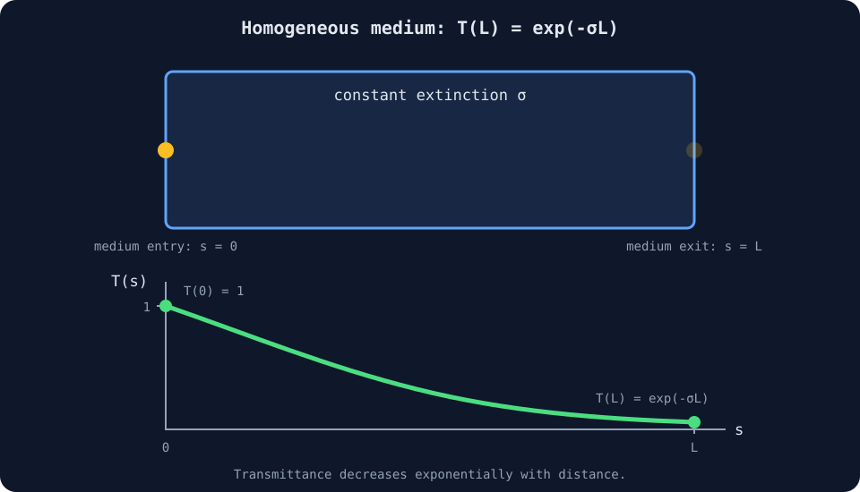

# 03 — Homogeneous Medium

## 목표

이 단계는 상자(box) 내부를 일정한 밀도(constant density)로 채웁니다.
광선(ray)을 따라 밀도가 변하지 않으므로 볼륨 렌더링(volume rendering)
방정식에는 닫힌 형태의 해(closed-form solution)가 존재합니다. 따라서 아직
광선을 여러 지점으로 전진시키는 ray marching 없이도 결과를 정확한 식으로
계산할 수 있습니다.

## 1. 무한히 짧은 거리에서의 소멸(Extinction)

\(T(s)\)를 거리 \(s\)만큼 이동한 뒤 살아남은 복사휘도(radiance)의
비율이라고 합니다. 아주 짧은 거리 \(ds\)에서 제거되는 비율은 다음 세 값에
비례합니다.

- 현재 살아남은 비율 \(T(s)\)
- 소멸 계수(extinction coefficient) \(\sigma\)
- 이동한 거리 \(ds\)

따라서:

\[
dT=-\sigma T(s)\,ds,
\qquad
\frac{dT}{ds}=-\sigma T.
\]

변수를 분리하면:

\[
\frac{dT}{T}=-\sigma\,ds.
\]

\(T(0)=1\) 조건에서 0부터 \(L\)까지 적분하면:

\[
\ln T(L)-\ln 1=-\sigma L,
\]

\[
T(L)=e^{-\sigma L}.
\]

이 식이 Beer–Lambert 법칙입니다.



매질에 들어올 때는 모든 복사휘도(radiance)가 남아 있어 \(T(0)=1\)입니다. 같은
\(\sigma\)가 유지되면 이동 거리 \(L\)이 길어질수록 살아남는 비율 \(T(L)\)이
지수적으로 감소합니다.

## 2. 밀도와 흡수

모듈은 단위가 없는 밀도 조절값(dimensionless density control) \(\rho\)와
흡수 계수(absorption coefficient) \(\kappa\)를 분리합니다.

\[
\sigma=\kappa\rho.
\]

광선(ray)이 매질 안에서 이동한 길이 \(L\)에 대한 광학적 깊이(optical depth)와
투과율(transmittance)은 다음과 같습니다.

\[
\tau=\kappa\rho L,
\qquad
T=e^{-\tau}.
\]

```wgsl
let optical_depth =
  params.absorption * params.density * distance_inside;
let transmittance = exp(-optical_depth);
```

## 3. 일정한 매질 색상 합성

흡수되어 사라진 비율은 \(1-T\)이고, 끝까지 살아남아 배경(background)에
도달하는 비율은 \(T\)입니다. 균질한 매질(homogeneous medium)의 일정한
색상(constant color)을 \(\mathbf{c}_m\)이라 하면 최종 색상은 다음과
같습니다.

\[
\mathbf{C}=(1-T)\mathbf{c}_m+T\mathbf{c}_{bg}.
\]

이 식은 연속 방출-흡수 적분(continuous emission–absorption integral)으로도
유도할 수 있습니다.

\[
\mathbf{C}_{m}
=
\int_0^L T(s)\sigma\mathbf{c}_m\,ds.
\]

\(T(s)=e^{-\sigma s}\)를 대입하면:

\[
\mathbf{C}_{m}
=
\mathbf{c}_m
\int_0^L \sigma e^{-\sigma s}\,ds
=
(1-e^{-\sigma L})\mathbf{c}_m.
\]

여기에 살아남은 배경(background)
\(e^{-\sigma L}\mathbf{c}_{bg}\)을 더하면 위의
합성 방정식(compositing equation)을 얻습니다.

## WGSL 구현

```wgsl
let distance_inside = interval.far - entry;
let optical_depth =
  params.absorption * params.density * distance_inside;
let transmittance = exp(-optical_depth);

let color =
  (1.0 - transmittance) * medium_color +
  transmittance * background;
```

## Uniform 메모리 규약

```wgsl
struct MediumParameters {
  density: f32,
  absorption: f32,
  half_extent: f32,
  _padding: f32,
};
```

TypeScript는 동일한 네 개의 32-bit 칸(slot)을 `Float32Array(4)`로
기록합니다. 마지막 칸은 uniform 크기를 16 byte로 맞추기 위한
여백(padding)입니다.

## 조절 항목

- `Density`: \(\rho\)를 변경합니다.
- `Absorption`: \(\kappa\)를 변경합니다.
- `Volume size`: 상자 크기와 가능한 ray 경로 길이 \(L\)을 함께 변경합니다.

밀도나 흡수를 두 배로 하면 광학적 깊이(optical depth)도 두 배가 됩니다.
매질 영역의 크기를 두 배로 해도 모든 ray 경로가 정확히 두 배가 되지는 않지만,
상자 중앙을 통과하는 경로는 대략 크기에 비례해서 길어집니다.

## 02단계에서 추가된 내용

- 광선(ray)과 상자의 교차 구간(interval)이 매질 내부의 실제 이동 거리를
  나타냅니다.
- 이동 거리를 보여주던 확인용 색상을 Beer–Lambert 투과율(transmittance)이
  대체합니다.
- 밀도가 일정하므로 해석적 해(analytic solution)를 사용합니다.
- 표본 추출 반복문(sampling loop), 3D texture, 조명(lighting)은 아직
  없습니다.
