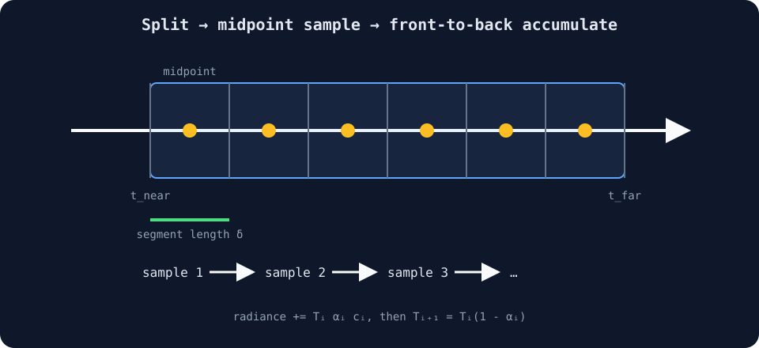

# 04 — Discrete Volume Rendering

## 목표

medium의 density가 이제 공간에 따라
$\sigma(\mathbf{r}(t))$로 변합니다. stage 03의 균질한 닫힌 형태의
해(homogeneous closed form)를 ray 전체에 적용할 수 없으므로 구간(interval)을
짧은 segment로 나누고 수치적으로
적분합니다.

이 단계는 이산 방출-흡수 방정식(discrete emission–absorption equation)을
구현합니다. density field는 WGSL shader 내부의 해석적 타원체(analytic
ellipsoid)이며 3D texture와 lighting은
아직 사용하지 않습니다.



교차 구간을 같은 길이의 segment로 나누고 각 segment의 midpoint에서
density를 읽습니다. sample은 camera에 가까운 순서대로 color와
transmittance에 누적됩니다.

## 1. 연속 방정식

ray가 다음과 같을 때:

$$
\mathbf{r}(t)=\mathbf{o}+t\mathbf{d},
$$

camera에 도달하는 color는:

$$
\mathbf{C}=
\int_{t_n}^{t_f}
T(t)\,
\sigma(t)\,
\mathbf{c}(t)\,dt
+
T(t_f)\mathbf{c}_{bg}.
$$

position $t$까지의 투과율(transmittance)은:

$$
T(t)=
\exp\left(
-\int_{t_n}^{t}\sigma(s)\,ds
\right).
$$

$\sigma(t)$의 단위는 거리의 역수(inverse distance)입니다. distance를
곱하면 무차원 광학적 깊이(dimensionless optical depth)가 됩니다.

## 2. 구간별 상수 근사(Piecewise-constant Approximation)

ray를 $N$개 segment로 나눕니다. segment $i$의 길이는:

$$
\delta_i=t_{i+1}-t_i.
$$

segment 내부에서 density와 color를 일정한 값(constant)
$\sigma_i,\mathbf{c}_i$으로 근사합니다. 이 segment에만 Beer–Lambert를
적용한 투과율(transmittance)은:

$$
T_{\mathrm{segment},i}=e^{-\sigma_i\delta_i}.
$$

불투명도(opacity)는 살아남지 못한 비율입니다.

$$
\alpha_i=1-e^{-\sigma_i\delta_i}.
$$

## 3. 각 Sample에 도달하기 전의 투과율

sample $i$에 도달하려면 이전 모든 segment를 통과해야 합니다.

$$
T_i=
\prod_{j<i}e^{-\sigma_j\delta_j}.
$$

$1-\alpha_j=e^{-\sigma_j\delta_j}$이므로:

$$
T_i=\prod_{j<i}(1-\alpha_j).
$$

sample $i$의 기여도(contribution)는 해당 sample에 도달할 확률과 그곳에서
종료될 확률의 곱입니다.

$$
w_i=T_i\alpha_i.
$$

따라서:

$$
\hat{\mathbf{C}}
=
\sum_{i=1}^{N}T_i\alpha_i\mathbf{c}_i
+
T_{N+1}\mathbf{c}_{bg}.
$$

## 4. 앞에서 뒤로 누적하기

shader는 sample마다 곱(product)을 다시 계산하지 않고 하나의 누적
값(running value)을 유지합니다.

```wgsl
var radiance = vec3f(0.0);
var transmittance = 1.0;

let alpha =
  1.0 - exp(-params.absorption * density * step_length);

radiance += transmittance * alpha * sample_color;
transmittance *= 1.0 - alpha;
```

update 전 `transmittance`는 $T_i$, update 후에는 $T_{i+1}$입니다.

## 5. 중점 Sampling

uniform step count를 사용하면:

$$
\delta=\frac{t_f-t_n}{N}.
$$

sample은 segment 중점(midpoint)에 배치합니다.

$$
t_i=t_n+\left(i+\frac12\right)\delta.
$$

```wgsl
let distance = entry + (f32(index) + 0.5) * step_length;
let position = origin + direction * distance;
```

중점 sampling(midpoint sampling)은 segment 시작점만 sampling하는 것보다
편향(bias)이 작습니다. 하지만 $\delta$가 크면 얇은 특징(feature)을 놓칠
수 있습니다.

## 6. 해석적 Density Field

다음 타원체 좌표(ellipsoidal coordinate)를 사용합니다.

$$
q(\mathbf{x})=
\left\|
\left(
\frac{x}{0.78h},
\frac{y}{0.52h},
\frac{z}{0.68h}
\right)
\right\|.
$$

$1-\operatorname{smoothstep}(0.35,1.0,q)$는 중앙이 가장 강하고 타원체(ellipsoid)
밖에서는 0인 부드러운 density를 만듭니다.

```wgsl
let normalized = position / params.half_extent;
let ellipsoid = length(normalized / vec3f(0.78, 0.52, 0.68));
return
  (1.0 - smoothstep(0.35, 1.0, ellipsoid)) *
  params.density_scale;
```

이 함수는 적분(integration) 학습에 집중하도록 의도적으로 단순하게 구성했습니다.

## 수식과 코드의 대응

| Equation | WGSL |
| --- | --- |
| $N$ | `step_count` |
| $\delta$ | `step_length` |
| $\sigma_i$ | `params.absorption * density` |
| $\alpha_i$ | `alpha` |
| $T_i$ | update 전 `transmittance` |
| $\mathbf{c}_i$ | `sample_color` |
| $\sum T_i\alpha_i\mathbf{c}_i$ | `radiance` |

## Parameters

- `Ray-march steps`: 중점 sample 개수
- `Density`: 해석적 density field에 적용하는 배수
- `Absorption`: 각 segment에 사용하는 absorption coefficient
- `Volume size`: box의 half-extent이며 공통 기본값은 $2$

## 수치적 특성

- step을 늘리면 적분 오차(integration error)가 줄지만 fragment 작업량(workload)은 선형으로
  증가합니다.
- $T<0.01$에서 조기 종료(early termination)하면 남은 background energy의 약 1%
  이하를 생략합니다.
- `MAX_STEPS = 256`은 WGSL에 정적인 반복 상한(static loop bound)을 제공하며 runtime count는
  loop exit 위치만 결정합니다.
