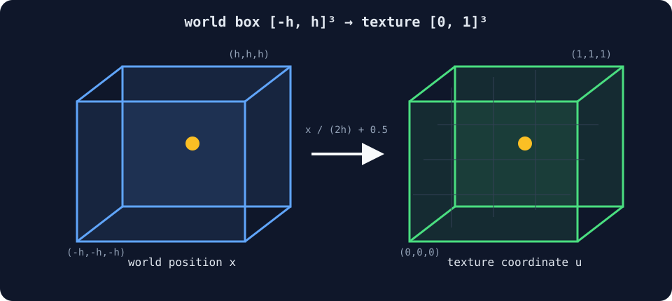
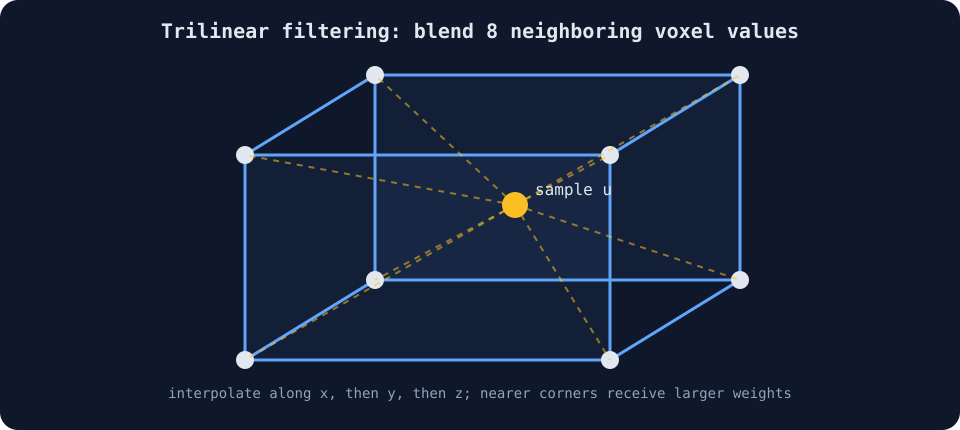
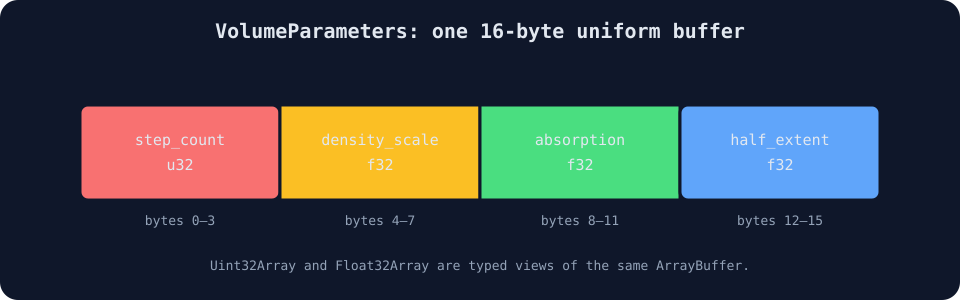

# 05 — Density Texture

## Goal

Stage 04 computed density directly from a WGSL function. This stage stores a
sampled scalar field on a three-dimensional grid and reads it through a
filterable `texture_3d<f32>`.

The volume rendering equation is unchanged:

\[
\alpha_i=1-e^{-\sigma_i\delta_i},
\qquad
T_i=\prod_{j<i}(1-\alpha_j),
\]

\[
\hat{\mathbf{C}}
=
\sum_i T_i\alpha_i\mathbf{c}_i
+
T_{N+1}\mathbf{c}_{bg}.
\]

Only the representation of \(\sigma_i\) changes.

## 1. Continuous position to texture coordinate

The world-space box spans:

\[
\mathbf{x}\in[-h,h]^3.
\]

A normalized texture coordinate must lie in \([0,1]^3\). First divide by the
full width \(2h\), producing \([-1/2,1/2]\), then add \(1/2\):

\[
\mathbf{u}
=
\frac{\mathbf{x}}{2h}+\frac12.
\]

```wgsl
fn world_to_texture(position: vec3f) -> vec3f {
  return position / (2.0 * params.half_extent) + 0.5;
}
```



## 2. Building the voxel data

`density-data.ts` creates a \(48^3\) grid. The center of voxel
\((x,y,z)\) is mapped to \([-1,1]^3\):

\[
p_x=2\frac{x+1/2}{W}-1,
\]

with analogous equations for \(p_y,p_z\). An ellipsoidal distance is:

\[
q=
\sqrt{
\left(\frac{p_x}{0.82}\right)^2+
\left(\frac{p_y}{0.55}\right)^2+
\left(\frac{p_z}{0.70}\right)^2
}.
\]

A smooth density transition is generated by:

\[
\rho=1-\operatorname{smoothstep}(0.25,1,q).
\]

The scalar is quantized into `r8unorm`:

\[
v=\operatorname{round}(255\rho).
\]

When sampled, WebGPU converts the byte back into approximately \(v/255\).
Quantization error is at most about \(1/(2\cdot255)\).

## 3. Uploading a 3D texture

```ts
this.volumeTexture = new TextureResource(this.device, {
  size: {
    width: DENSITY_VOLUME_SIZE,
    height: DENSITY_VOLUME_SIZE,
    depthOrArrayLayers: DENSITY_VOLUME_SIZE,
  },
  dimension: "3d",
  format: "r8unorm",
  usage: GPUTextureUsage.TEXTURE_BINDING | GPUTextureUsage.COPY_DST,
});
```

`writeTexture()` interprets the linear CPU array with:

```ts
{
  bytesPerRow: DENSITY_VOLUME_SIZE,
  rowsPerImage: DENSITY_VOLUME_SIZE,
}
```

One byte stores one voxel, one row stores one \(x\) scanline, and
`rowsPerImage` advances from one \(z\) slice to the next.

## 4. Trilinear filtering

For a coordinate between eight neighboring voxels, a linear sampler performs
three nested linear interpolations. In one dimension:



\[
\operatorname{lerp}(a,b,f)=(1-f)a+fb.
\]

Applying this along \(x\), then \(y\), then \(z\) combines all eight corner
values. The shader requests that filtered density with:

```wgsl
let density = textureSampleLevel(
  density_texture,
  density_sampler,
  texture_position,
  0.0,
).r * params.density_scale;
```

Without filtering, the \(48^3\) grid would appear as visible voxel blocks.

## 5. Bindings

| Binding | Resource | Purpose |
| --- | --- | --- |
| 0 | camera uniform | reconstruct the world-space ray |
| 1 | `texture_3d<f32>` | stored scalar density |
| 2 | filtering sampler | trilinear interpolation |
| 3 | volume uniform | steps, density, absorption, box size |

The TypeScript `VolumeParameters` storage is 16 bytes:



`Uint32Array` and `Float32Array` are views of the same `ArrayBuffer`, so each
field is written with the type declared by WGSL.

## 6. Parameters

- `Ray-march steps`: number of midpoint texture samples.
- `Density`: multiplier applied to the sampled density.
- `Absorption`: absorption coefficient used by each segment.
- `Volume size`: box half-extent, with a shared default of \(2\).

## 7. What remains deliberately absent

- No density gradient or surface normal.
- No light direction.
- No secondary march toward a light.
- No self-shadow or powder approximation.

Every sample uses one constant pale color. Shape and opacity therefore come
only from density and transmittance.
